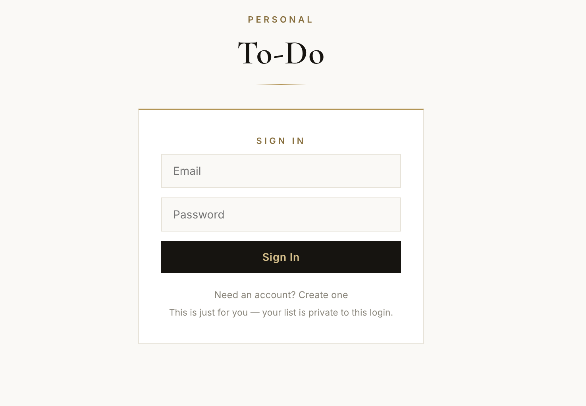
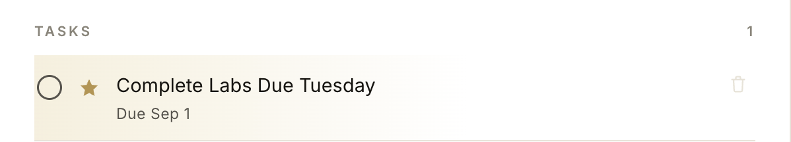
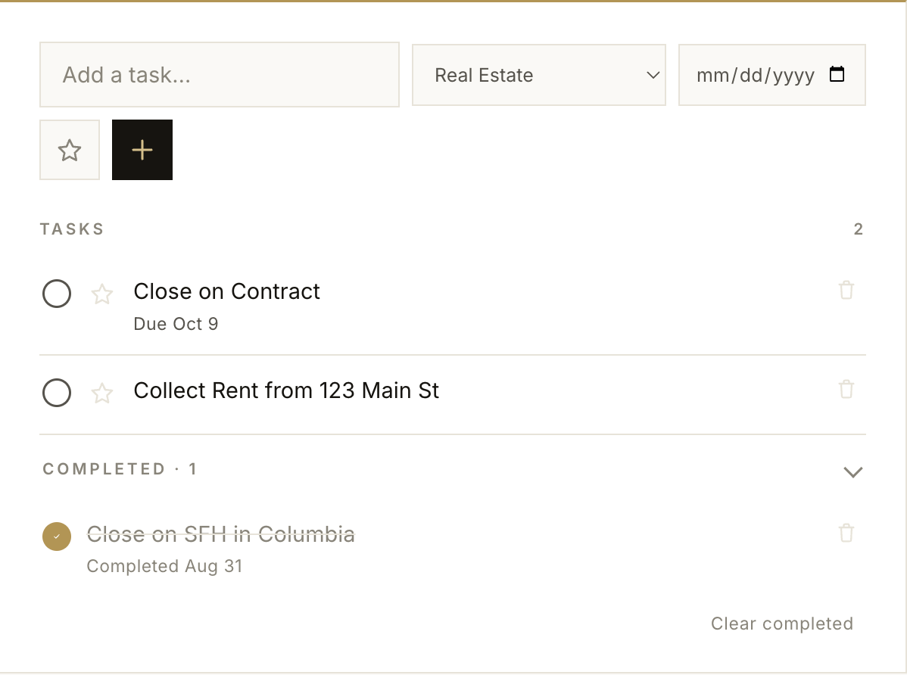

# Personal Task Manager — Firebase-Backed To-Do App

**Live demo:** https://brendan-to-do.web.app
**Repo:** https://github.com/brendanmrojas-ops/personal-todo-firebase

---

## ⚡️ Overview

I built a personal task management web app that I use daily across my phone and laptop. It started as a simple single-user to-do list and grew into a fully authenticated, real-time synced application backed by Google Firebase — meaning any task I check off on my phone updates instantly on my laptop, and vice versa, without a page refresh.

I designed and built this end-to-end myself: the front-end UI, the data model, the authentication flow, the database security rules, and the deployment pipeline. No boilerplate templates or starter kits — every line was purpose-built for how I actually organize my work across my businesses.

**Primary technologies:** HTML5, CSS3, vanilla JavaScript (ES modules), Firebase Authentication, Cloud Firestore, Firebase Hosting, Firebase CLI

**Key features:**
- 🔐 Email/password authentication — each user's data is fully private and isolated
- 🔄 Real-time cross-device sync (no manual refresh, no polling)
- 🏷️ Custom task categories with color-coded labels (Personal, business, learning, etc.)
- ⭐ Urgent flagging that auto-sorts priority tasks to the top
- 📅 Due dates with automatic overdue detection
- ✅ Completed tasks collapse out of the way into their own section

---

## 📸 Screenshot Gallery

**Sign-in screen**



**Main task view — category tabs with color-coded bullets**


**Urgent task — gold highlight and filled star**



**Completed tasks section expanded**



---

## 🚀 Detailed Project Walkthrough

### 1. Front-End Design

The UI is a single self-contained `index.html` file — no build tools, no framework, no bundler. I made this choice deliberately: for a personal-scale project like this, a framework would add complexity without adding value. Everything (HTML, CSS, and JavaScript) lives in one file, which also makes it trivially portable — I can hand this one file to any static host and it just works.

I used CSS custom properties (`:root` variables) to define a consistent design system (colors, spacing) so the whole visual identity could be adjusted from one place rather than hunting through scattered styles.

### 2. Data Model

Each user's tasks live in a single Firestore document:

```
/todos/{userId}
  └── data: "<JSON-stringified array of task objects>"
```

Each task object looks like:

```json
{
  "id": "t1a2b3c4",
  "text": "Finish September script batch",
  "category": "First Class Creators",
  "dueDate": "2026-09-05",
  "urgent": true,
  "createdAt": 1735500000000,
  "completedAt": null
}
```

I chose to store the whole task list as a single JSON blob per user (rather than one Firestore document per task) to keep reads and writes to a minimum — Firestore's free tier is quota-based, and a personal to-do list doesn't need per-task granularity. This keeps the app well within the free Spark plan indefinitely.

### 3. Authentication & Security

I used Firebase Authentication with the email/password provider. On load, the app listens for auth state changes:

```javascript
onAuthStateChanged(auth, user => {
  if (user) {
    // show the app, subscribe to this user's data
  } else {
    // show the sign-in screen
  }
});
```

Critically, authentication alone doesn't protect data — Firestore Security Rules do. I wrote rules that lock each document to only be readable/writable by the account that owns it:

```
rules_version = '2';
service cloud.firestore {
  match /databases/{database}/documents {
    match /todos/{userId} {
      allow read, write: if request.auth != null && request.auth.uid == userId;
    }
  }
}
```

This means even if someone found my hosting URL, they'd hit a login wall — and even if they somehow authenticated, the rules block them from ever reading or writing to any document that isn't their own `userId`. This is the same pattern (least-privilege, identity-scoped access) used in production access-control systems, just at a much smaller scale.

### 4. Real-Time Sync

Instead of a "save and reload" pattern, I used Firestore's `onSnapshot` listener, which pushes live updates to every connected client the moment the underlying document changes:

```javascript
onSnapshot(doc(db, 'todos', uid), snapshot => {
  tasks = JSON.parse(snapshot.data().data);
  render();
});
```

This is what makes the cross-device sync feel instant rather than requiring a manual refresh.

### 5. Deployment

I deployed the app using the Firebase CLI rather than a drag-and-drop host, since it ties hosting, auth, and the database together under one project and one workflow:

```bash
npm install -g firebase-tools
firebase login
firebase init hosting
firebase deploy
```

`firebase init hosting` walks through connecting the local folder to the Firebase project and configuring the public directory. `firebase deploy` pushes the current files live and returns a permanent Hosting URL (`https://brendan-to-do.web.app`).

---

## 🧩 Challenges & Solutions

**Challenge:** My first `npm install -g firebase-tools` failed with an `EACCES` permission error.
**Solution:** The global npm directory required elevated permissions on macOS. I resolved this by running the install with `sudo`.

**Challenge:** Node.js wasn't installed on my machine at all, which `npm` depends on.
**Solution:** Installed the LTS version directly from nodejs.org, then re-ran the install.

**Challenge:** When renaming my file to `index.html`, Finder had "hide file extensions" enabled by default, so my renamed file silently became `index.html.html`.
**Solution:** Enabled "Show all filename extensions" in Finder settings so I could see and fix the real filename before deploying.

**Challenge:** I initially built this using Claude's built-in artifact storage, which only persists inside Claude's own interface.
**Solution:** Once I needed the app to be a truly independent, cross-device tool, I migrated the storage layer from Claude's artifact API to Firebase Authentication + Firestore, and deployed it as a standalone hosted app — decoupling it entirely from any one platform.

---

## 🧪 Testing

Testing was manual and functional, appropriate for a project of this scale:
- Verified sign-up, sign-in, and sign-out flows on both desktop and mobile browsers
- Confirmed real-time sync by editing on one device and watching the update appear on another within a second
- Manually attempted to read another test account's data path to confirm Firestore rules correctly blocked cross-account access

---

## ⚙️ Performance Considerations

- No build step and no framework overhead — the entire app is a single static HTML file
- Firebase SDKs are loaded as ES modules directly from Google's CDN, and I only import the specific services I use (`app`, `auth`, `firestore`) rather than the full SDK bundle
- Storing the task list as one document per user keeps Firestore reads/writes minimal, which matters on a metered free tier

---

## 📚 Summary

Through this project I got hands-on practice with:
- Setting up and configuring a cloud project (Firebase/Google Cloud) from scratch
- Implementing real user authentication rather than a fake or mocked login
- Writing and testing database security rules that enforce per-user data isolation
- Deploying a live, publicly reachable application through a command-line workflow
- Debugging real environment issues (permissions, missing dependencies, filesystem quirks) rather than working in a pre-configured sandbox

This project sits alongside the broader systems and DevOps skills I'm building — cloud project setup, access control, and CLI-driven deployment are the same underlying concepts used at larger scale in professional infrastructure work.

---

## 🔗 References

- [Firebase Authentication Docs](https://firebase.google.com/docs/auth)
- [Cloud Firestore Docs](https://firebase.google.com/docs/firestore)
- [Firestore Security Rules Docs](https://firebase.google.com/docs/firestore/security/get-started)
- [Firebase Hosting Docs](https://firebase.google.com/docs/hosting)
- [Firebase CLI Reference](https://firebase.google.com/docs/cli)
